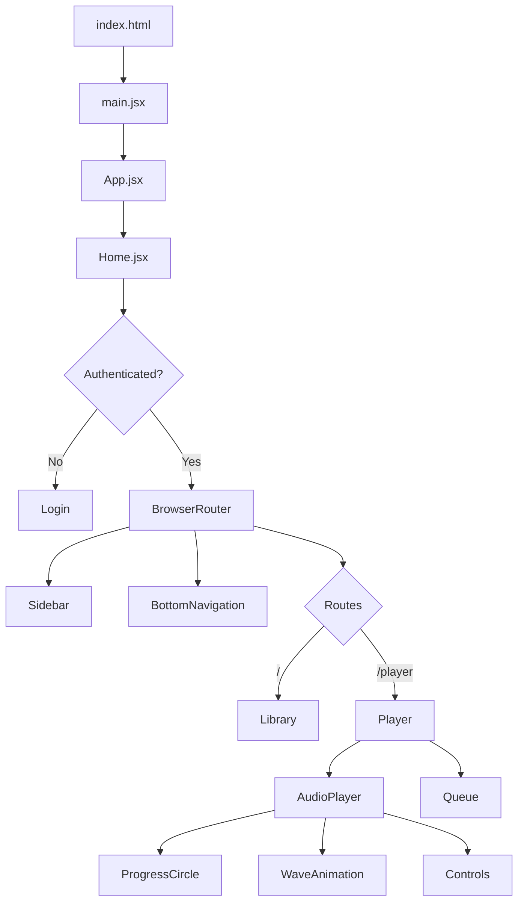
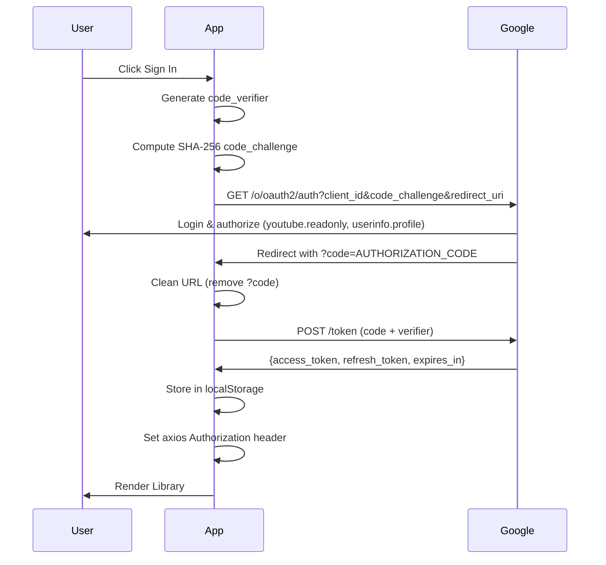
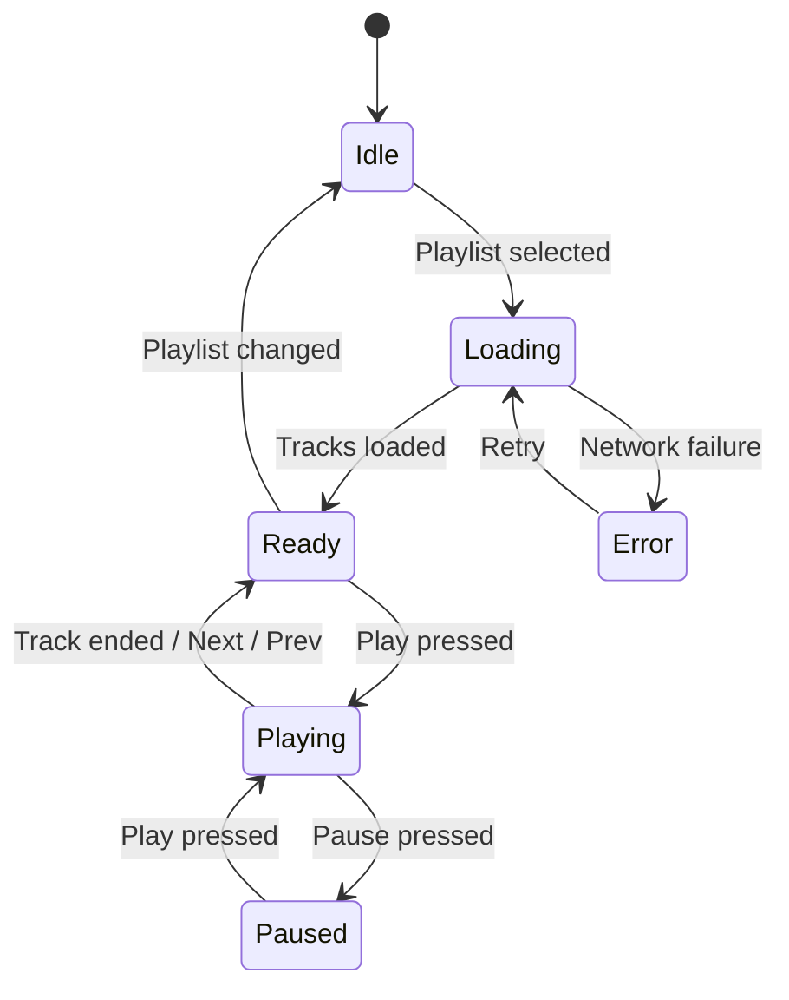
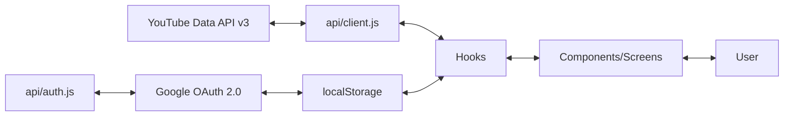
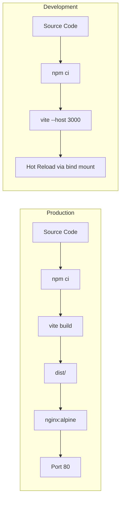

# MusicPlayer


[](https://github.com/DessimA/MusicPlayer)

Music player powered by YouTube Data API v3. Built with React, Vite, and Docker. Features Google OAuth PKCE authentication, mobile-first responsive design, and full audio playback via the YouTube IFrame Player API.

## Architecture



## Google OAuth PKCE Flow



## Playback State



## Project Structure

```
musicplayer/
├── Dockerfile               Multi-stage production build
├── Dockerfile.dev           Development with hot-reload
├── docker-compose.yml       Dev environment
├── docker-compose.prod.yml  Production environment
├── nginx/default.conf       Production nginx with CSP
├── index.html               Entry HTML with CSP meta tags
├── vite.config.js           Vite configuration
├── vitest.config.js         Test configuration
└── src/
    ├── main.jsx              Entry point
    ├── App.jsx               Root component
    ├── api/                  YouTube/Google API layer
    │   ├── auth.js           Google OAuth PKCE
    │   ├── client.js         Axios instance
    │   └── endpoints.js      API URLs & scopes
    ├── hooks/                React hooks
    │   ├── useAuth.js        Auth state management
    │   ├── usePlaylistTracks.js  YouTube playlist item fetching
    │   └── useAudioPlayer.js     YouTube IFrame Player playback
    ├── utils/
    │   └── formatters.js     formatDuration
    ├── styles/
    │   ├── variables.module.css  Design tokens
    │   └── global.css            Reset & base styles
    ├── screens/
    │   ├── Home/             Auth gate & router
    │   ├── Login/            Google sign-in
    │   ├── Library/          YouTube playlist grid
    │   └── Player/           Full player view with video + queue
    ├── components/
    │   ├── Sidebar/          Desktop navigation
    │   ├── BottomNavigation/ Mobile navigation
    │   ├── SongCard/         Video thumbnail + info
    │   ├── Queue/            Track list with search
    │   ├── AudioPlayer/      Controls & visualizers
    │   └── ui/               Primitives (Spinner, ErrorMessage, EmptyState, SkeletonLoader)
    └── tests/
        └── setup.js
```

## Data Flow



## Docker



## Setup

### Prerequisites

- Docker & Docker Compose (recommended) or Node.js 20+
- [Google Cloud Console account](https://console.cloud.google.com/) (free, no credit card required)

### Google API Configuration

1. Go to [Google Cloud Console](https://console.cloud.google.com/)
2. Create a new project or select an existing one
3. Enable the **YouTube Data API v3**
4. Go to **APIs & Services** → **Credentials**
5. Click **Create Credentials** → **OAuth 2.0 Client ID**
6. Application type: **Web application**
7. Add `http://127.0.0.1:3000` and `http://localhost:3000` as **Authorized JavaScript origins** and **Authorized redirect URIs**
8. Copy the **Client ID** and **Client Secret**
9. (Optional) Create an **API Key** for additional YouTube Data API access

### Environment

```bash
cp .env.example .env
# Edit .env with your Google Client ID and Client Secret
```

> The OAuth client type is **Web application** (confidential client), so `client_secret` is required in the token exchange body even with PKCE.

### Add test users

1. Go to Google Cloud Console → **APIs & Services** → **OAuth consent screen**
2. Add your Google email as a **Test user**
3. Publishing status must be **Testing** unless you verify the app

### Docker (recommended)

```bash
# Development (hot-reload)
docker compose up

# Production build
docker compose -f docker-compose.prod.yml up
```

Open http://localhost:3000

### Without Docker

```bash
npm install
npm run dev       # http://localhost:3000
npm run build     # Production build to dist/
npm test          # Run tests
```

## Features

- **Google OAuth PKCE** for secure, token-based authentication (no client secret exposed to server)
- **YouTube IFrame Player** provides full audio playback with video visibility toggle
- **Background playback** audio continues when switching tabs or minimizing video
- **Minimizable video** hide video to save screen space while music plays
- **Searchable queue** filter tracks within the current playlist
- **localStorage** persists tokens across page refreshes (recommended by Google OAuth docs)
- **Auto token refresh** via refresh_token grant
- **Error handling** on all API calls with user-facing fallback UI
- **Loading states** with skeleton loaders and spinners
- **Empty states** when playlists or tracks are unavailable
- **Mobile-first responsive design** with bottom navigation
- **CSS Modules** for scoped, conflict-free styles
- **Minimalist UI** clean, flat buttons with consistent sizing
- **Custom hooks** `useAuth`, `usePlaylistTracks`, `useAudioPlayer` encapsulate logic
- **Docker multi-stage builds** for development and production
- **17 unit/integration tests** with Vitest
- **No hardcoded secrets** Google credentials via environment variables
- **CSP headers** in both HTML meta tag and nginx production config
- **Info modal** accessible from sidebar and bottom navigation
- **MIT licensed** with contributing and security guidelines

## Documentation

- [MIT License](LICENSE)
- [Terms of Use](TERMS.md)
- [Contributing](CONTRIBUTING.md)
- [Security](SECURITY.md)
